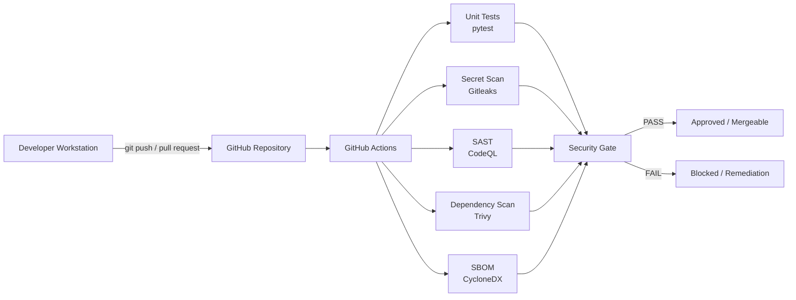

# Architecture

## Overview

This project uses a GitHub-native DevSecOps pipeline. A small FastAPI application is the target, and every code change is validated by automated security controls running on GitHub-hosted runners.

The architecture avoids local infrastructure, virtual machines, and containers for basic operation, making it suitable for a lightweight portfolio project and a Bazzite Linux workstation with limited storage.

## Diagram

A Mermaid source version of this architecture is maintained in [`diagrams/pipeline.mmd`](../diagrams/pipeline.mmd).

## Components

### Developer Workstation

The local machine used to write code and tests. For this project, the workstation runs Bazzite Linux. Only lightweight development tasks are performed locally; all security scanning happens in GitHub Actions.

### GitHub Repository

Stores source code, workflow definitions, tests, and documentation. The repository is public and serves as the portfolio artifact.

### GitHub Actions

Hosts the CI/CD pipeline. Workflows are triggered on pushes to `main` and on pull requests. GitHub-hosted runners execute the jobs.

### Workflows

| Workflow | File | Responsibility |
|----------|------|----------------|
| CI | `.github/workflows/ci.yml` | Run tests and generate SBOM artifact. |
| CodeQL | `.github/workflows/codeql.yml` | Run static analysis for Python. |
| Gitleaks | `.github/workflows/gitleaks.yml` | Scan repository history for secrets. |
| Trivy | `.github/workflows/trivy.yml` | Scan filesystem and dependencies for vulnerabilities. |

### Security Gate

The collective result of all workflows. A pull request cannot be safely merged until every workflow passes. Branch protection rules can enforce this in GitHub settings.

## Data Flow

1. A developer pushes a commit or opens a pull request.
2. GitHub triggers the four workflows.
3. Each workflow performs its specific security or quality check.
4. Results are displayed in the pull request checks panel and the Actions tab.
5. If all checks pass, the change is considered safe to merge.
6. If any check fails, the developer follows the remediation workflow.

## Design Decisions

| Decision | Rationale |
|----------|-----------|
| GitHub-hosted runners | Avoids local infrastructure and works on any host, including Bazzite. |
| Separate workflows | Makes failures isolated and easy to understand. |
| Least-privilege permissions | Reduces blast radius if a workflow is compromised. |
| No `pull_request_target` | Prevents untrusted PR code from running with privileged credentials. |
| Full commit SHA action pins | Prevent tag movement from silently changing CI action code. |
| In-memory storage | Keeps the application simple; no database required. |

## Future Scaling

If the application grows, the architecture can be extended with:

- Branch protection rules requiring passing checks.
- OpenSSF Scorecard for repository security posture.
- Deployment workflows with environment-specific gates.
